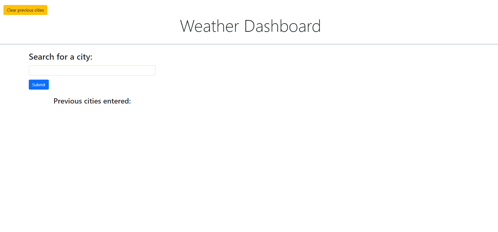
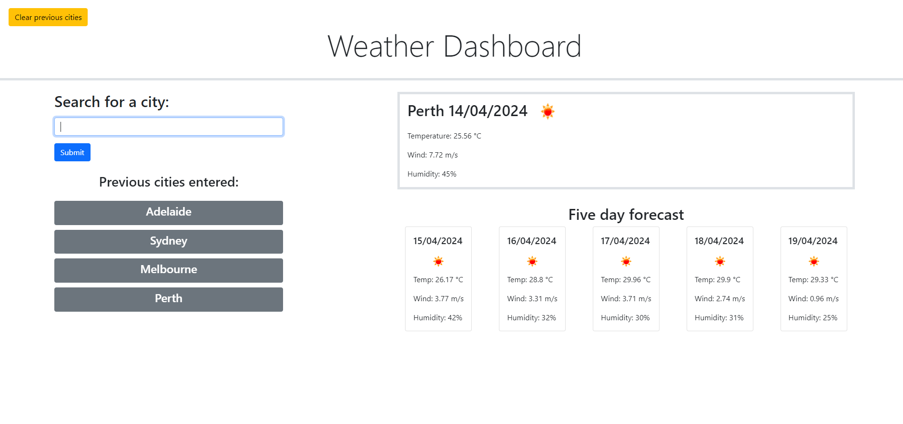
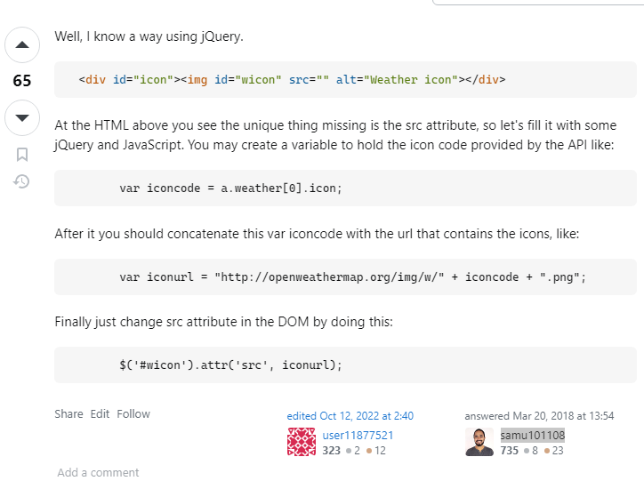

# 6-Challenge-Weather-Dashboard

## Description

This project is a weather dashboard application built using HTML, CSS and Javascript. It serves as the week 6 challenge for The University of Sydney's Coding Bootcamp.

This application was built to display accurate weather data for a city name entered by a user. The data presented then shows the current weather information and a five day forecast for the specific city. Each city input is also saved on the web page under the input field and can be clicked on to recall that weather data for that respective city. These cities are also saved in local storage and will remain on the page after a refresh. 

The application solves the problem of not having a quick and easy way to check the current and future weather for a city. This application would be especially useful for someone travelling to multiple cities and wants to check the weather for their trip. 

By building this project, I gained a solid understanding of how to use API calls to display and manipulate the data stored within.

## Screenshots of deployed application:

### Weather Dashboard before city input:

### Weather Dashboard after multiple city inputs:

## Usage

If you want to access the application easily, [visit the working GitHub Pages link here](https://isaacfallon.github.io/6-Challenge-Weather-Dashboard/) or by accessing the full link:
https://isaacfallon.github.io/6-Challenge-Weather-Dashboard/

Alternatively, you can also clone the repository and run the project locally. [Refer to this guide from GitHub if you need help.](https://docs.github.com/en/repositories/creating-and-managing-repositories/cloning-a-repository/)

## Credits

My codebase utilises code from one external source.

[In this StackOverflow question,](https://stackoverflow.com/questions/44177417/how-to-display-openweathermap-weather-icon) the user 'Ajay Krishna Dutta' asks about how to obtain the OpenWeather icons when calling the API. The response from user 'samu101108' details how to obtain the icons using a combination of jquery and string concatenation as shown below:

My codebase uses these snippets of code when calling the current and future weather from lines 110 to 215 in my script.js file. 

(Full link to question and answer on StackOverflow: https://stackoverflow.com/questions/44177417/how-to-display-openweathermap-weather-icon)

## License

MIT License

Copyright (c) 2024 isaacfallon

Permission is hereby granted, free of charge, to any person obtaining a copy
of this software and associated documentation files (the "Software"), to deal
in the Software without restriction, including without limitation the rights
to use, copy, modify, merge, publish, distribute, sublicense, and/or sell
copies of the Software, and to permit persons to whom the Software is
furnished to do so, subject to the following conditions:

The above copyright notice and this permission notice shall be included in all
copies or substantial portions of the Software.

THE SOFTWARE IS PROVIDED "AS IS", WITHOUT WARRANTY OF ANY KIND, EXPRESS OR
IMPLIED, INCLUDING BUT NOT LIMITED TO THE WARRANTIES OF MERCHANTABILITY,
FITNESS FOR A PARTICULAR PURPOSE AND NONINFRINGEMENT. IN NO EVENT SHALL THE
AUTHORS OR COPYRIGHT HOLDERS BE LIABLE FOR ANY CLAIM, DAMAGES OR OTHER
LIABILITY, WHETHER IN AN ACTION OF CONTRACT, TORT OR OTHERWISE, ARISING FROM,
OUT OF OR IN CONNECTION WITH THE SOFTWARE OR THE USE OR OTHER DEALINGS IN THE
SOFTWARE.